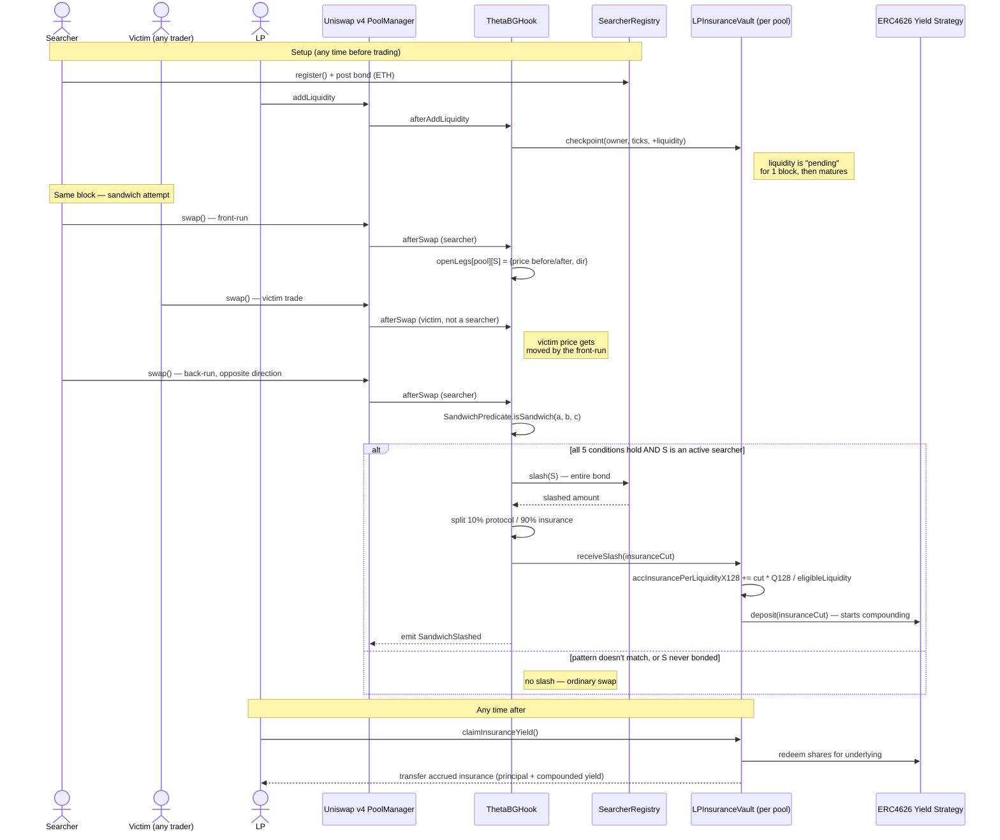

# Theta-BG

**A Uniswap v4 hook that turns MEV sandwich attacks into LP insurance —
automatically, on-chain, in the same block the attack happens.**

Built for **UHI10 — Sustainable Liquidity & MEV Protection**.

> Sandwich me and lose your bond — and that bond becomes LP yield,
> automatically, on-chain, in the same block.

This repository is a from-scratch, senior-engineering-reviewed
implementation, not a direct transcription of the original pitch document
(`Theta-BG.md`). Several of that document's mechanism claims did not survive
contact with actual Uniswap v4 / EVM semantics and were corrected — read
`V4_ARCHITECTURE_VALIDATION.md` first if you're comparing this code against
the original pitch.

---

## The problem

Sandwich attacks are the most common form of MEV extraction against
Uniswap-style AMMs. A searcher spots a pending swap, front-runs it to move
price against the victim, lets the victim's trade execute at the worse
price, then back-runs it to capture the spread — all inside one block.

Today, pools have exactly two responses to this:

1. **Do nothing.** LPs and traders absorb the cost as background noise —
   it's priced into spreads, but never returned to the people it was taken
   from.
2. **Route around it** — private mempools, encrypted order flow,
   MEV-Boost relays. These help, but they're off-chain, trust third-party
   infrastructure, and do nothing for the pool itself: even a sandwich
   that *does* get through leaves the LPs who supplied the liquidity with
   nothing to show for having been the venue for someone else's extraction.

There is no mechanism, anywhere in the standard v4 stack, that **detects a
sandwich as it happens and redirects the attacker's own capital to the
people it harmed.**

## The solution

Theta-BG is a single `IHooks` implementation with three moving parts:

1. **A bonded priority lane.** Searchers who want to trade against a
   Theta-BG pool register and post a native-ETH bond with the
   `SearcherRegistry`. Only bonded, registered searchers are ever evaluated
   for sandwich behavior — an ordinary trader who never registers can never
   be slashed, no matter what pattern their trades happen to form.
2. **On-chain, same-block sandwich detection.** `ThetaBGHook` watches every
   swap through the pool. A pure, storage-free five-condition predicate
   (`SandwichPredicate.sol`) checks whether three same-block swaps —
   front-run, victim, back-run — form a genuine bracket: same searcher on
   both ends, a distinct victim in the middle, opposite trade directions,
   a real price displacement, and a restoration back to close to the
   starting price. All five conditions must hold simultaneously; this is a
   conjunction, not a fuzzy score.
3. **A self-compounding LP insurance vault.** The instant a sandwich is
   confirmed, the attacker's *entire bond* is slashed in the same
   transaction — no dispute window, no governance vote. 10% goes to the
   protocol; the rest is wrapped and deposited into the pool's own
   `LPInsuranceVault` (one per pool, ERC4626-backed), where it starts
   compounding yield immediately and accrues to LPs who actually had
   eligible liquidity in the pool at the time, via a reward-per-liquidity
   accumulator — the same pattern Uniswap itself uses for fee growth, not
   a bespoke distribution scheme.

The result: an attacker's own bond becomes the insurance fund for the exact
liquidity they tried to extract from — settled atomically, on-chain, with no
off-chain relay, no oracle, and no admin key.

## Why this matters

- **MEV protection that pays LPs instead of just avoiding a cost.** Private
  mempools reduce sandwich *frequency*; Theta-BG makes a sandwich, if it
  still happens, generate a return for the exact pool it targeted.
- **No trusted third party.** Detection, slashing, and distribution all
  happen inside the hook's own `afterSwap` callback, using only Uniswap's
  standard swap/liquidity callbacks and price state. There's no relay to
  trust, no off-chain keeper, no oracle to manipulate.
- **Immutable, not governed.** Every economic parameter
  (`restorationThresholdBps`, `minDisplacementBps`, `priorityFeeBps`,
  `protocolShareBps`, `minimumBond`) is set once at deployment and is
  `immutable`. There is no owner, no upgrade path, no function that can
  redirect insurance funds or change slashing behavior after the fact. The
  only privileged call, `withdrawProtocolFees()`, can move nothing but fees
  the protocol is already entitled to.
- **Honest about its own limits.** Detection is scoped to same-block,
  same-pool, single-searcher round trips — not a claim to catch every form
  of MEV. `LIMITATIONS.md` states exactly what is and isn't covered, and
  `SECURITY.md` documents the threat model per actor. This is a design
  choice about where a purely on-chain, oracle-free predicate can operate
  soundly, not an oversight.
- **Proven live, not just in a test suite.** Deployed on Unichain Sepolia,
  with a real front-run → victim → back-run sequence executed at
  *production* thresholds and a genuine on-chain slash — transaction
  hashes and measured before/after numbers in `DEPLOYMENT.md`.

## Design principles

- **A conjunction, not a heuristic.** All five predicate conditions are
  independently necessary; none is independently sufficient. No scoring,
  no probabilistic thresholds — a pattern either satisfies all five
  conditions or nothing happens.
- **Scope the blast radius of a false positive to those who opted in.**
  Only bonded, registered searchers are ever run through the predicate.
  The worst case for an innocent pattern-match is a searcher who chose to
  bond loses that bond — never an ordinary trader who never registered.
- **Reuse Uniswap's own accounting instead of inventing new state.**
  Priority fees ride v4's native fee-growth/donate mechanism; insurance
  distribution uses a reward-per-liquidity accumulator, the same family of
  pattern as `feeGrowthGlobal`/MasterChef-style reward accounting — not a
  bespoke ledger.
- **No enumeration, no retroactivity.** LPs claim against an accumulator,
  never an iterated list of positions. Liquidity that wasn't eligible
  before a slash never retroactively receives a share of it — closing
  that gap cleanly needs an append-only checkpoint history, not a
  "trust the current state" shortcut (see `MECHANISM.md` for why this
  needed a one-block liquidity maturation delay to close a flash-liquidity
  exploit).
- **Slash the whole bond, always.** There is no partial-slash logic and no
  "bond too small to cover the penalty" edge case — the slash is
  definitionally bounded by whatever the bond currently holds, which is
  also the strongest deterrence signal available for the least complexity.
- **Immutable by default; the only privileged action touches only money
  the protocol already owns.** See "Why this matters" above.

## Architecture — user flow



**Reading the diagram:** the front-run, victim trade, and back-run are three
*separate transactions* in the same block — not one atomic transaction. The
hook has no way to intervene *during* the sandwich; instead it recognizes the
completed pattern the instant the back-run lands, and the slash + insurance
credit happen inside that same `afterSwap` call. There is no keeper, no
off-chain watcher, and no delay between detection and payout.

## Contracts

```
src/ThetaBGHook.sol                   IHooks implementation — identity resolution, open-leg
                                       tracking, predicate evaluation, slash triggering,
                                       priority-fee collection, LP liquidity checkpointing
src/SearcherRegistry.sol              Bond accounting (one instance, shared across every
                                       pool this hook deployment serves)
src/LPInsuranceVault.sol              Insurance accounting (one instance per pool, deployed
                                       from afterInitialize; ERC4626-backed yield compounding)
src/libraries/SandwichPredicate.sol   Pure, storage-free five-condition predicate
```

See `ARCHITECTURE.md` for the full contract-responsibility breakdown and
the rationale for "one registry, many vaults."

## Start here

| Doc | What's in it |
|---|---|
| [`REPOSITORY_AUDIT.md`](REPOSITORY_AUDIT.md) | Starting state, what changed, dependency versions |
| [`V4_ARCHITECTURE_VALIDATION.md`](V4_ARCHITECTURE_VALIDATION.md) | Every mechanism checked against real v4-core source — what v4 actually does, what Theta-BG needed, and what was corrected |
| [`ARCHITECTURE.md`](ARCHITECTURE.md) | Contract responsibilities, data flow, why one registry / many vaults |
| [`MECHANISM.md`](MECHANISM.md) | The five-condition predicate formalized, bond economics, insurance-vault semantics |
| [`SECURITY.md`](SECURITY.md) | Threat model by actor, invariants |
| [`LIMITATIONS.md`](LIMITATIONS.md) | What this build does *not* do yet, stated explicitly |
| [`DEPLOYMENT.md`](DEPLOYMENT.md) | Live on Unichain Sepolia — verified addresses, and a real on-chain slash with transaction hashes |

## Dependencies

`lib/` is gitignored — at ~100MB of vendored Uniswap v4 / OpenZeppelin /
forge-std source it doesn't belong in the repo, and these were installed as
plain cloned directories rather than proper git submodules (some upstream
submodules inside `v4-core`/`v4-periphery` don't check out cleanly via a
straight `forge install`). After cloning this repo, restore them with:

```shell
git clone --depth 1 https://github.com/foundry-rs/forge-std.git lib/forge-std
git clone --depth 1 https://github.com/Uniswap/v4-core.git lib/v4-core
git clone --depth 1 https://github.com/Uniswap/v4-periphery.git lib/v4-periphery
git clone --depth 1 https://github.com/OpenZeppelin/openzeppelin-contracts.git lib/openzeppelin-contracts
git clone --depth 1 https://github.com/transmissions11/solmate.git lib/v4-core/lib/solmate
```

(`v4-core`'s own `lib/openzeppelin-contracts` submodule comes along with its
clone; only `lib/v4-core/lib/solmate` needs the extra step above, since
`Deployers.sol`'s test helpers depend on it.)

## Build & test

```shell
forge build
forge test
```

252 tests across 8 suites — pure predicate unit + fuzz tests, registry and
vault unit + fuzz tests, a full end-to-end integration suite against a real
`PoolManager`, a dedicated false-positive checklist, an adversarial suite,
and two Foundry invariant suites (128,000 randomized calls each). See
`LIMITATIONS.md` §"Testing" for the exact breakdown, including two verified
findings the adversarial suite surfaced.

```shell
forge test -vv                                    # verbose
forge test --match-path "test/ThetaBGHook.t.sol"  # integration only
forge test --match-path "test/invariant/*"        # invariant suites only
```

## Status

Contracts and tests are real and passing against actual `v4-core` /
`v4-periphery` / OpenZeppelin dependencies (see `remappings.txt`). **Live on
Unichain Sepolia** — see `DEPLOYMENT.md` for verified contract addresses and
a real, on-chain sandwich detection + slash at production thresholds
(transaction hashes included). A live read-and-write console is built in
`web/` (Vite + React + wagmi/viem + RainbowKit) — it reads all state from
chain and drives the searcher bond lifecycle and LP insurance claims from a
connected wallet. See `web/README.md`, and `LIMITATIONS.md` for what's
deliberately deferred.
